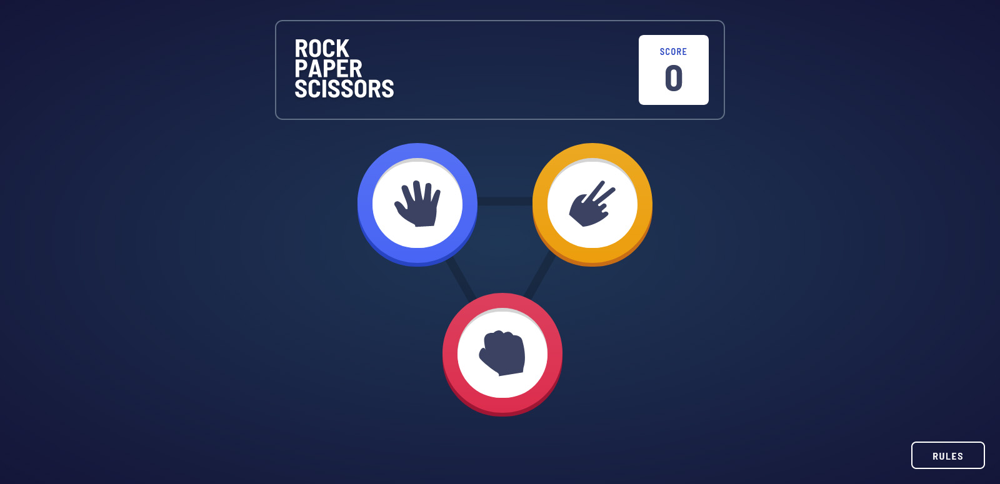

# Frontend Mentor - Rock, Paper, Scissors solution

This is a solution to the [Rock, Paper, Scissors challenge on Frontend Mentor](https://www.frontendmentor.io/challenges/rock-paper-scissors-game-pTgwgvgH). Frontend Mentor challenges help you improve your coding skills by building realistic projects. 

## Table of contents

- [Overview](#overview)
  - [The challenge](#the-challenge)
  - [Screenshot](#screenshot)
  - [Links](#links)
- [My process](#my-process)
  - [Built with](#built-with)
  - [What I learned](#what-i-learned)
  - [Continued development](#continued-development)
- [Author](#author)

## Overview

### The challenge

Users should be able to:

- View the optimal layout for the game depending on their device's screen size
- Play Rock, Paper, Scissors against the computer

### Screenshot

### Links

- Live Site URL: [Add live site URL here](https://rps-challenge-ucz.netlify.app/)

## My process

### Built with

- Mobile-first workflow
- [React](https://reactjs.org/) - JS library
- [Next.js](https://nextjs.org/) - React framework
- [Tailwind CSS](https://tailwindcss.com/) - For styling

### What I learned

Improving my skills in the mobile-first workflow! Thanks to Tailwind this was extremely easy, I went from the mobile UI to the desktop version in a few minutes only using CSS. Very cool! Despite it not being part of the challenge itself, I wanted to give it some smooth animations to make things flow nicely, I'm quite pleased with how they turned out, I could've done more of course, but at some point it starts to get in the way of the user experience. I'm also quite happy with how reusable the buttons are, adding the optional game mode would be quite simple in that regard.

### Continued development

My understanding of CSS still isn't perfect, sometimes it can take a while to get going for no real reason. Also, I plan to continue working hard on reusable components and Typescript, they are very powerful tools and made developing this a lot easier.

## Author

- Frontend Mentor - [@uncoolzero](https://www.frontendmentor.io/profile/uncoolzero)
- Twitter - [@uncoolzero](https://www.twitter.com/uncoolzero)